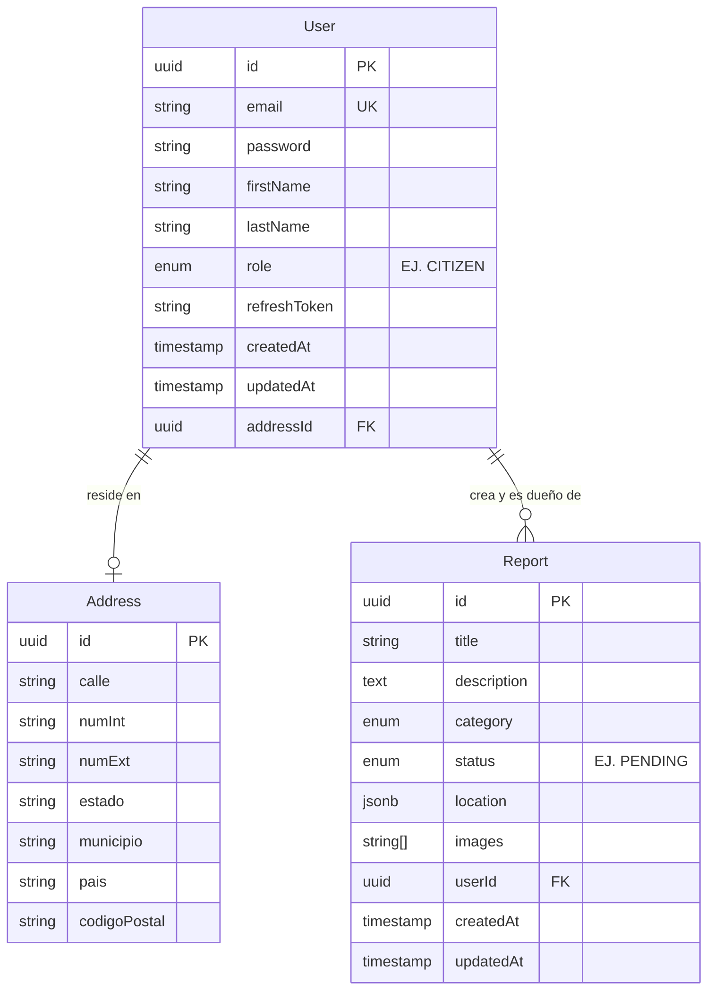

# ATento

## 📌 ¿Qué es ATento?
ATento es una aplicación web diseñada para que los ciudadanos puedan reportar incidentes o problemas en su comunidad de manera eficiente. Este proyecto proporciona un sistema centralizado donde los usuarios pueden crear reportes geolocalizados (con imágenes y descripciones), permitiendo un mapeo claro de los problemas urbanos y facilitando su gestión. Además, el sistema busca ayudar a prevenir duplicados analizando y agrupando problemas reportados en ubicaciones cercanas en el mapa mediante algoritmos de *clustering*.

## 🚀 Funciones y Características Principales
- **Autenticación y Autorización:** Registro y login de usuarios con roles definidos (ej. Ciudadanos, Administradores) protegido y firmado mediante JWT.
- **Creación de Reportes Geolocalizados:** Los usuarios pueden generar un reporte indicando la ubicación exacta en un mapa, junto con un título, descripción, categoría y estado del incidente.
- **Manejo de Evidencias:** Soporte para adjuntar imágenes como evidencia al realizar los reportes.
- **Clustering y Prevención de Duplicados en Mapas:** Funcionalidad avanzada en el frontend para detectar reportes cercanos generados previamente y sugerirlos al usuario, previniendo así un doble reporte de la misma incidencia.
- **Visualización en Tiempo Real:** Infraestructura base de WebSockets (Socket.io) pensada para proveer actualizaciones o cambios en mapa sin recargar la pantalla.
- **Monorepo y Código Compartido:** Arquitectura escalable mediante `pnpm workspaces` para reutilizar de forma efectiva las definiciones, tipos y esquemas entre el frontend y backend (`@atento/shared`).
- **Documentación de API:** Definición completa de la arquitectura REST con Swagger UI.

## 🛠️ Stack Tecnológico

**Frontend (`atento-client`):**
- **Framework:** Angular 21
- **Componentes UI:** PrimeNG
- **Estilos:** Tailwind CSS v4 (utilitario)
- **Mapas:** Leaflet
- **Comunicación en Tiempo Real:** Socket.io client

**Backend (`atento-server`):**
- **Framework:** NestJS 11
- **Motor ORM e interconexión:** TypeORM
- **Autenticación:** Passport y JWT (bcrypt)
- **WebSockets:** `@nestjs/websockets` / Socket.io
- **API UI:** `@nestjs/swagger`

**Base de Datos y Herramientas:**
- **Sistema Gestor de Base de Datos:** PostgreSQL 17 (vía imagen de Alpine en Docker)
- **Despliegue y Virtualización:** Docker y Docker Compose
- **Gestor de Paquetes:** pnpm

---

## 📊 Diagrama Entidad-Relación (ER)

El siguiente modelo ilustra las dos principales entidades dentro de la base de datos PostgreSQL, definiendo los usuarios de la plataforma y los reportes creados por ellos:



---

## ⚙️ Puesta en Marcha (Getting Started)

Sigue estos pasos para levantar el entorno de desarrollo del proyecto en tu máquina local.

### Prerrequisitos
- Node.js (versión 20 o superior recomendada)
- `pnpm` (puedes instalarlo mediante `npm install -g pnpm`)
- Docker Desktop o el motor de Docker + Docker Compose, necesario para levantar la BDD Postgres.

### Guía Paso a Paso

1. **Clona y entra a la carpeta del repositorio**
   ```bash
   git clone <URL_DEL_REPOSITORIO>
   cd ATento
   ```

2. **Instala las dependencias del Monorepo**
   Este proyecto gestiona de forma centralizada sus librerías. Ejecuta desde la ruta principal:
   ```bash
   pnpm install
   ```

3. **Puesta a punto de las Variables de Entorno**
   Asegúrate de preparar o verificar el archivo `.env` localizado en la raíz para la configuración de la base de datos y la instancia Docker.

4. **Levantar la Base de Datos (PostgreSQL)**
   El contenedor con Postgres y su respectivo volumen será montado en segundo plano, por ende, es prioritario antes de arrancar el servidor:
   ```bash
   docker compose up -d db
   ```

5. **Iniciar los Servicios de la Aplicación**

   Para agilidad en el desarrollo, puedes correr una ventana para el backend y otra para el frontend, o arrancar ambos con el script ya configurado en el package raíz.

   - **Solo Backend:**
     ```bash
     pnpm start:server
     ```
   - **Solo Frontend:**
     ```bash
     pnpm start:client
     ```
   - **Ambos al mismo tiempo:**
     ```bash
     pnpm start:all
     ```

6. **Accesos a la Aplicación:**
   - **Aplicación (Angular):** [http://localhost:4200](http://localhost:4200)
   - **Servidor y Swagger API:** Normalmente el servicio arranca en un puerto predefinido (ej. 3000), visita `/api` para confirmar con Swagger UI.
